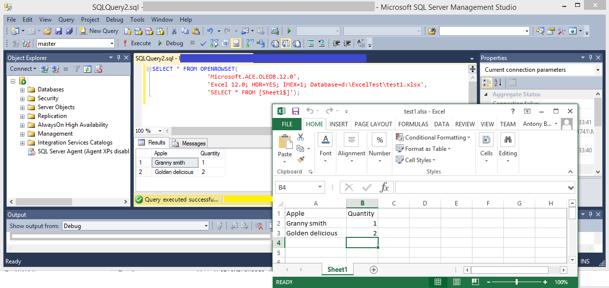
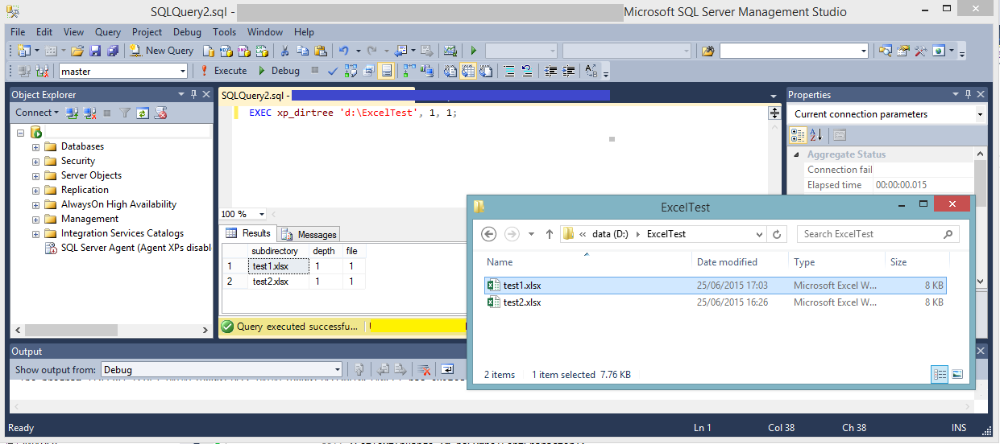
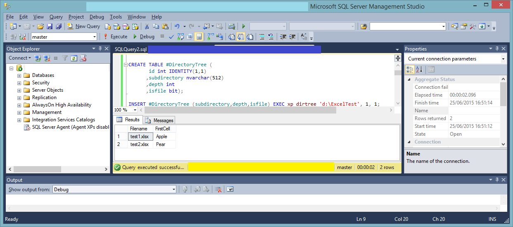

# Mircosoft SQL Server can read Excel documents

Something that was pretty cool to discover a few days ago is that Mircosoft SQL Server can read Excel documents.  Subject to having the right permissions, it works using a TSQL query like this:

```sql
SELECT * FROM OPENROWSET( 
                'Microsoft.ACE.OLEDB.12.0',
                 'Excel 12.0; HDR=YES; IMEX=1; Database=d:\ExcelTest\test1.xlsx',
                 'SELECT * FROM [Sheet1$]');
```



You will need to change the path to the Excel document, and you may need to change the sheet name or the HDR flag which indicates whether the first row of the
worksheet should be treated as the HeaDeR row i.e. a row containing fields names but no actual data.  But getting a look inside an Excel spreadsheet really is that simple.

Furthermore TSQL can also be used to read the contents of directories:

```sql
EXEC xp_dirtree 'd:\ExcelTest', 1, 1;
```



## Setting up SQL Server for reading from Excel

There's a good article about this here, so I wont repeat the content of it.

http://www.aspsnippets.com/Articles/The-OLE-DB-provider-Microsoft.Ace.OLEDB.12.0-for-linked-server-null.aspx

I wouldn't do this on an existing production server, because there may be a good reason why the settings mentioned in Solution 3 are off by default.  My preference is
to have a local install of SQL Server and extract the data there, and only move the data somewhere more central once I am happy with it.


## Putting it all together

We can combine the two techniques into a TSQL script which can scan all the Excel documents within a directory or directories.
The script I've written creates a table containing the filename and the contents of the first cell.

[CombinedExample.sql](./CombinedExample.sql)



However, we are no longer banging out a few TSQL queries - this is starting to look more like full-on computer programming.  Beyond a certain
point it must surely make more sense to just bite the bullet and use a more conventional programming language, but I am thrilled to have
discovered this approach for simpler extractions.
